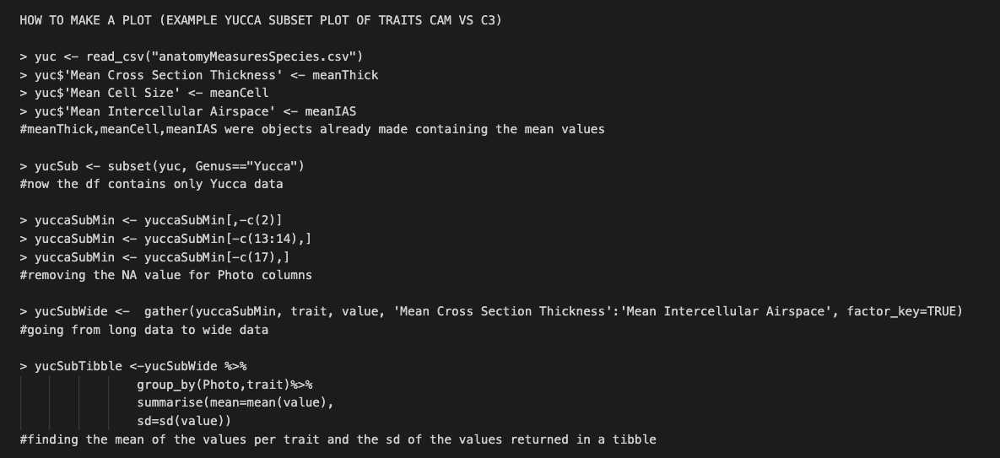

## 🌵 Bioinformatics Photosynthesis Evolution Project R work 🌵

When hungry, Agavoideae plants can always go for a liGhT sNacK

### 🌵 Overview 🌵

Code from RStudio was saved as .txt file for future reference for the language of R while conducting research under [Dr. Karolina Heyduk](https://github.com/kheyduk) on the evolution of CAM (crassulacean acid metabolism) accross species in the Agavoideae. 

### 🥬 General R 🍀 

- In the .txt file myrwork.txt, I show the methods of data import, subsetting data, taking a mean, adding a column, and conducting a t-test in RStudio with data from anatomical measurements of microscopic plant cross section images.

### 🌴 Plotting in R 🌵

- In the .txt file posterPlots.txt, I show the methods of plotting in R. Shown below is a screenshot from posterPlots.txt showing the code in R to create a plot, and the plot thus generated. Note, CAM photosynthesis, and here, the comparison to C3 photosynthesis was part of the interest of the research.

