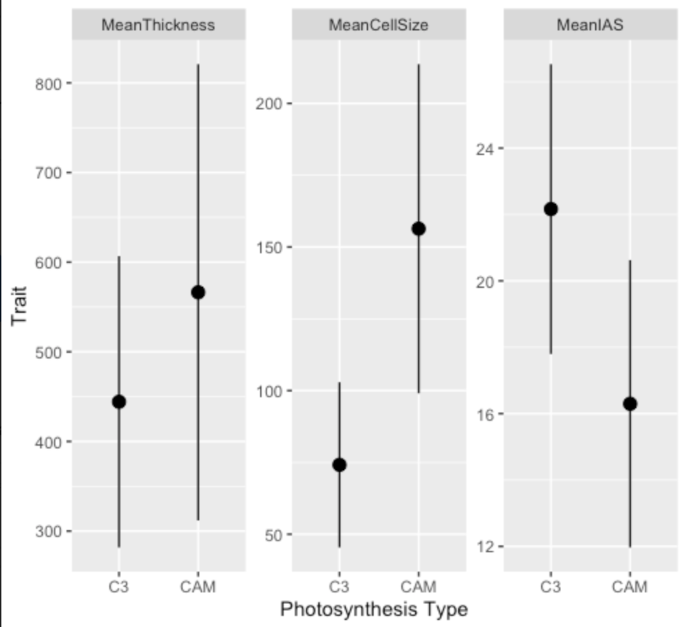

## 🌵 Bioinformatics Photosynthesis Evolution Project R work 🌵

When hungry, Agavoideae plants can always go for a liGhT sNacK

### 🌵 Overview 🌵

Code from RStudio was saved as .txt file for future reference for the language of R while conducting research under [Dr. Karolina Heyduk](https://github.com/kheyduk) on the evolution of CAM (crassulacean acid metabolism) accross species in the Agavoideae. 

### 🥬 General R 🍀 

- In the .txt file myrwork.txt, I show the methods of data import, subsetting data, taking a mean, adding a column, and conducting a t-test in RStudio with data from anatomical measurements of microscopic plant cross section images.

### 🌴 Plotting in R 🌵

- In the .txt file posterPlots.txt, I show the methods of plotting in R. Shown below is a screenshot from posterPlots.txt showing the code in R to create a plot, and the plot thus generated. Note, CAM photosynthesis, and here, the comparison to C3 photosynthesis was part of the interest of the research.
```R
> anatMinimalWide <-  gather(anatMinimal, trait, value, meanThick:meanCell, factor_key=TRUE)
# to go from wide to long plot (see csv's in folder)


> myTibbleTemp <- plotPoster %>%
+     group_by(Photo,trait)%>%
+     summarise(mean=mean(value),
+               sd=sd(value))
#to group it right (see myTibbleTemp.csv)
#myTibbleTemp was renamed to plotTibble


> temp<-plotTibble[-c(7:9),]
#cut off the bottom 3 rows (don't need NA values for Photo)


> ggplot(temp, aes(x=Photo, y=mean)) + facet_wrap(~trait, scales="free_y") +geom_point(pch=21,size=3)+ 
+     geom_pointrange(aes(ymin=mean-sd, ymax=mean+sd))
#plotting 3 plots at once (from function facet_wrap) geom_pointrange for SD bars


> p <- ggplot(temp, aes(x=Photo, y=mean)) + facet_wrap(~trait, scales="free_y") +geom_point(pch=21,size=3)+ 
+     geom_pointrange(aes(ymin=mean-sd, ymax=mean+sd))
> p+labs(title="Tooth length per dose", x="Dose (mg)", y = "Length")
>     
> p+labs( x="Photosynthesis Type", y = "Trait")
#to title x and y axis

> write.csv(anat, "AnatomyMeasures.csv")
#note that this is csv is the most useful anat measure


HOW TO MAKE A PLOT (EXAMPLE YUCCA SUBSET PLOT OF TRAITS CAM VS C3)

> yuc <- read_csv("anatomyMeasuresSpecies.csv")
> yuc$'Mean Cross Section Thickness' <- meanThick
> yuc$'Mean Cell Size' <- meanCell
> yuc$'Mean Intercellular Airspace' <- meanIAS
#meanThick,meanCell,meanIAS were objects already made containing the mean values

> yucSub <- subset(yuc, Genus=="Yucca")
#now the df contains only Yucca data

> yuccaSubMin <- yuccaSubMin[,-c(2)]
> yuccaSubMin <- yuccaSubMin[-c(13:14),]
> yuccaSubMin <- yuccaSubMin[-c(17),]
#removing the NA value for Photo columns

> yucSubWide <-  gather(yuccaSubMin, trait, value, 'Mean Cross Section Thickness':'Mean Intercellular Airspace', factor_key=TRUE)
#going from long data to wide data

> yucSubTibble <-yucSubWide %>%
                group_by(Photo,trait)%>%
                summarise(mean=mean(value),
                sd=sd(value))
#finding the mean of the values per trait and the sd of the values returned in a tibble
```


